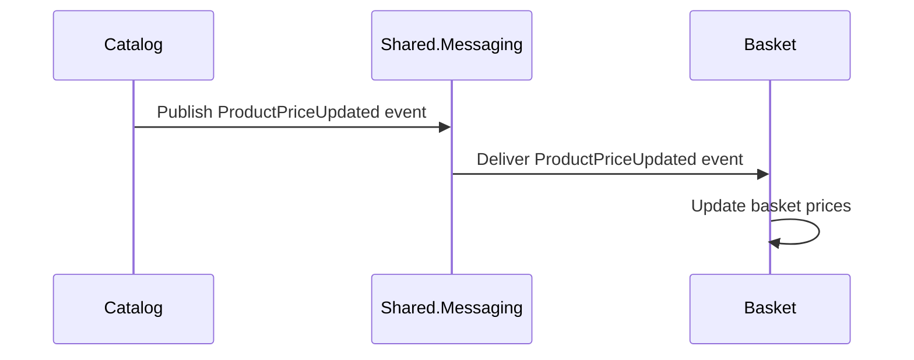

# Event-Driven Price Update Flow in Modular Monolith

## What is Event-Driven Architecture?

Event-driven architecture (EDA) is a design pattern where modules communicate by publishing and subscribing to events, rather than calling each other directly. This decouples modules, making your system more flexible and maintainable.

---

## How It Works in This Solution

### 1. Modules Involved

- **Catalog**: Manages product data, including prices.
- **Basket**: Manages user shopping baskets, which reference product prices.
- **Shared.Messaging**: Contains contracts and infrastructure for sending/receiving events.

### 2. The Price Update Scenario

- When a product’s price changes in the Catalog, an event (e.g., `ProductPriceUpdated`) is published.
- The Basket module subscribes to this event. When it receives the event, it updates the prices in user baskets accordingly.

---

## Example Flow



---

## Example Event Contract

```csharp
// Shared.Messaging/Events/ProductPriceUpdated.cs
public class ProductPriceUpdated
{
    public Guid ProductId { get; set; }
    public decimal NewPrice { get; set; }
}
```

---

## Example Usage

### Catalog Publishes Event

```csharp
// CatalogModule.cs
public void UpdateProductPrice(Guid productId, decimal newPrice)
{
    // ... update price in database ...
    var priceUpdatedEvent = new ProductPriceUpdated { ProductId = productId, NewPrice = newPrice };
    _eventBus.Publish(priceUpdatedEvent);
}
```

### Basket Subscribes and Handles Event

```csharp
// BasketModule.cs
public class ProductPriceUpdatedHandler : IEventHandler<ProductPriceUpdated>
{
    public Task Handle(ProductPriceUpdated @event)
    {
        // Find all baskets containing the product and update the price
        // ... update logic ...
        return Task.CompletedTask;
    }
}
```

---

## Benefits

- **Loose Coupling**: Modules don’t need to know about each other’s internals.
- **Scalability**: Easy to add new features (e.g., notifications) by subscribing to events.
- **Maintainability**: Changes in one module don’t directly affect others.

---

## Summary Table

| Module           | Role in Event-Driven Flow                |
|------------------|------------------------------------------|
| Catalog          | Publishes price update events             |
| Shared.Messaging | Defines event contracts, routes events    |
| Basket           | Subscribes to price update events         |

---

## Key Points

- Use events to decouple modules and improve maintainability.
- Shared.Messaging provides the contracts and infrastructure for event communication.
- Catalog publishes events when product prices change.
- Basket listens for these events and updates basket prices accordingly.

---

_Review this section to ensure it matches your implementation and understanding. Update code samples and flow as needed for your specific architecture._
